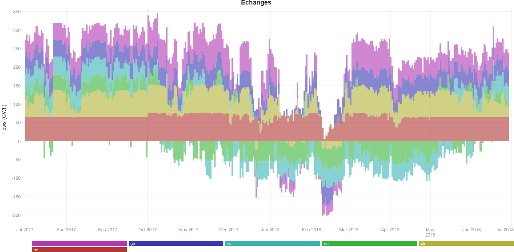

# Onglet échanges

## Echanges commerciaux aux frontières

Visualisez le solde des échanges commerciaux d'électricité simulés entre un pays et l’ensemble de ses voisins électriques. 

Pour la France par exemple, vous avez la possibilité d’afficher les données des frontières avec l'Angleterre, la Belgique, l'Allemagne, la Suisse, l'Italie, l'Espagne et l’Irlande.

## Comprendre cet affichage

Le Bilan prévisionnel s’appuie sur un outil de simulation des marchés de l’électricité. Les flux publiés représentent donc les soldes des échanges commerciaux aux frontières de chaque pays.
